# Coffee Shop Enterprise Network Design

## Project Overview

This project utilizes Cisco Packet Tracer to demonstrate a real-world enterprise network solution for a business environment. The objective is to design, implement, and secure a production-ready network architecture for a local coffee shop deployment using Cisco IOS. 

### The Network Solution
To satisfy modern business requirements, this network infrastructure incorporates multiple Virtual Local Area Networks (VLANs) and a dedicated Guest Wi-Fi, including a centralized DHCP server to hand out IP addresses automatically to all VLANs. This design guarantees clear logical separation across different operational environments:

1.  **Management Office Traffic (VLAN 10):** Restricts access to corporate systems, office computers, and local administration resources.
2.  **Point of Sale (POS) Systems (VLAN 20):** Dedicates a network segment for card processing registers.
3.  **Guest Wi-Fi Subnet (VLAN 30):** Public internet access for customer devices through wireless Access Points, isolated from internal resources.

Leaving a business network unsegmented exposes critical payment processing systems and office infrastructure to potential malicious attacks on public access links. By combining Layer 2 port security(BPDU Guard and administrative port shutdowns) with Layer 3 inter-VLAN routing and automated IP addressing.

### Network Topology Architecture

Below is the production ready network layout designed:

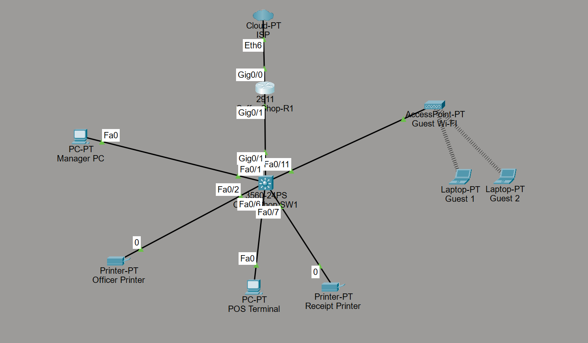
**[Download the Cisco Packet Tracer Lab File (.pkt)](./configs/Coffee-shop-network-deployment.pkt)**


## Cisco IOS Configuration Breakdown (`Coffeeshop-SW1`)

The local coffee shop switch was configured. Below is a detailed breakdown of the commands implemented, their technical functions, and the custom security enhancements added to improve the baseline topology.

---

### 1. Device Management & Hardening

*   **`enable secret`**
    *   **Technical Function:** Encrypts and protects the privileged EXEC mode access using a secure hashing algorithm.
    *   **Purpose:** Prevents unauthorized local users from entering configuration mode and altering device settings.
*   **`service password-encryption`**
    *   **Technical Function:** Scrambles plain-text passwords (such as console or line passwords) into a Type-7 encrypted format within the configuration file.
    *   **Purpose:** Protects administrative credentials from being read in clear text during configuration reviews or accidental text leaks.
*   **`banner motd`**
    *   **Technical Function:** Establishes a custom Message of the Day (MOTD) banner that displays instantly upon terminal connection.
    *   **Purpose:** Provides a clear legal warning stating that unauthorized access is strictly prohibited.
*   **`line console 0` & `password`**
    *   **Technical Function:** Enters the physical console port configuration interface and maps a local authentication password to it.
    *   **Purpose:** Secures the switch from unauthorized administrative access via a direct, physical console cable connection.
*   **`logging synchronous`**
    *   **Technical Function:** Synchronizes unsolicited IOS terminal alerts with active user keyboard command-line inputs.
    *   **Purpose:** Prevents system logs and diagnostic messages from interrupting or splitting up text while an administrator is actively typing commands.

---

### 2. Layer 2 Segmentation & Port Security

#### VLAN 10: Management Office
*   **Purpose:** Isolates back-office administrative computers and corporate office devices.
*   **Interfaces:** `FastEthernet 0/1` through `0/5` this was done for future expansion.
*   **Configuration:** Ports set to static access mode (`switchport mode access`) and explicitly bound to VLAN 10 (`switchport access vlan 10`).
*   **STP Optimization:** `spanning-tree portfast` enabled to bypass standard Listening/Learning delays, granting immediate network connectivity to office hardware.
*   **Hardening (Not done in the video):** 
    *   `spanning-tree bpduguard enable` was explicitly deployed to prevent network loops and topology manipulation if an unauthorized switch or router is connected to an office port.
    *   Unused assigned interfaces (`Fa0/3` - `Fa0/5`) were put into an administrative `shutdown` state as an industry best practice to prevent rogue physical access.

#### VLAN 20: Point of Sale (POS) Systems
*   **Purpose:** Dedicates an isolated network segment strictly for cash registers and credit card transaction devices. 
*   **Interfaces:** `FastEthernet 0/6` through `0/10` this was done for future expansion.
*   **Configuration:** Interfaces locked down to static access mode and assigned directly to VLAN 20.
*   **STP Optimization:** PortFast enabled to ensure financial endpoints connect and acquire DHCP addressing instantly upon boot.
*   **Hardening (Not done in the video):** 
    *   **BPDU Guard** was deployed to safeguard financial endpoints from loop-inducing hardware.
    *   Unused ports within the block (`Fa0/8` - `Fa0/10`) were administratively **shut down** to eliminate physical tampering vulnerabilities in customer-facing areas.

#### VLAN 30: Guest Wi-Fi
*   **Purpose:** Allocates an isolated segment dedicated exclusively to public customer wireless traffic.
*   **Interfaces:** `FastEthernet 0/11` (Connecting to the physical Wireless Access Point).
*   **Configuration:** Configured as a static access port on VLAN 30 with PortFast active, allowing the wireless access point to join the forwarding state instantly.

####  VLAN 99: Network Management SVI
*   **Purpose:** Creates a dedicated,virtual management segment to securely administer local infrastructure hardware.
*   **Configuration:** Configured via `interface Vlan99` with a static IP address (`192.168.99.2 /24`) and default gateway to enable remote administrative visibility and control plane traffic across subnets.

#### Unused Interfaces Hardening
*   **Hardening (Not done in the video):** All remaining unused interfaces (`Fa0/12` through `Fa0/24` and `Gi0/2`) were manually targeted with a `shutdown` command.

---

### 3. Core Uplink Trunk

*   **High-Speed Trunk Port (`GigabitEthernet 0/1`)**
    *   **Technical Function:** Configured as a formal 802.1Q trunk link (`switchport mode trunk`).
    *   **Purpose:** Acts as a high-speed multi-lane highway, allowing isolated traffic streams from VLANs 10, 20, 30, and 99 to travel securely to the core router across a single physical link using frame tags (`dot1q`).
### 4. Remote Management & Control Plane Hardening (SSHv2)
*   **Secure Remote Shell (SSHv2) Implementation**
    *   **Technical Function:** Configured secure virtual lines (`line vty 0 15`) to restrict access exclusively to encrypted SSHv2 traffic while completely disabling cleartext Telnet.
    *   **Purpose:** Secures remote management across the network by establishing an internal domain name (`Coffeeshop.local`), generating RSA cryptographic key pairs, and creating a dedicated local administrator profile (`username admin privilege 15`).
 

### Verification & Output Validation

To verify that the Layer 2 configuration was successfully applied and that all local interfaces are operating as expected, the following Cisco IOS verification commands were executed:

<details>
<summary><b>Click to View Verification Screenshots</b></summary>

#### 1. VLAN Verification (`show vlan brief`)
This output confirms that all functional VLANs (10, 20, 30) were properly created and that the respective access interfaces were successfully mapped to their domains.

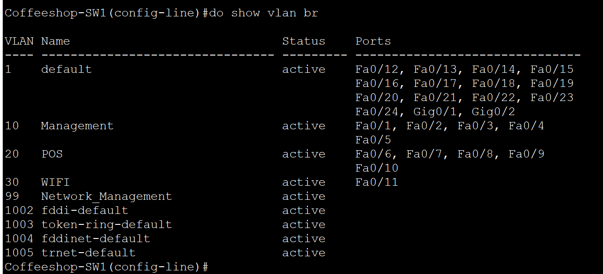

#### 2. Interface Status Verification (`show ip interface brief`)
This output verifies the Layer 3 Switched Virtual Interface (SVI) for the Management VLAN 99 is assigned the correct IP address (`192.168.99.2`) and that all unused physical ports are successfully in an `administratively down` state.

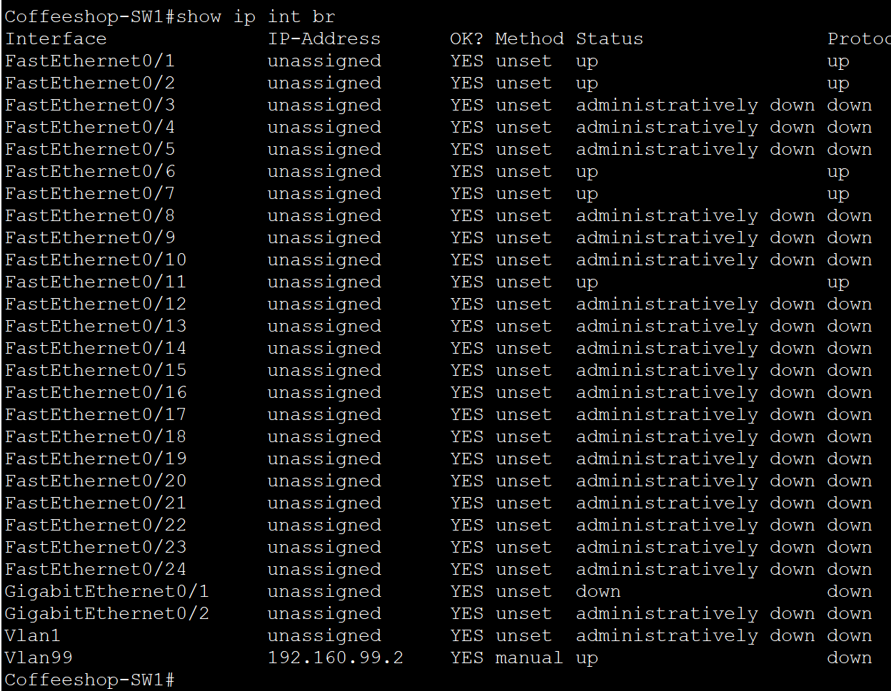

</details>

## Verification & Security Validation

To verify that the infrastructure operates exactly as intended, the coffee shop network was subjected to simulated perimeter security testing. **Before** the final administrative port shutdown commands were applied to the unused interfaces).


<details>
<summary><b> Click to View Live BPDU Guard Security Testing</b></summary>

#### Live Security Testing: BPDU Guard Enforcement
To validate our perimeter security hardening, a rogue switch was maliciously attached to a secure customer-facing access port.

*   **Topology Impact:** The switch instantly detected incoming foreign Bridge Protocol Data Units (BPDUs). To prevent a network loop or unauthorized Spanning Tree takeover, **BPDU Guard** immediately auto-tripped and forced the interface into a secure `err-disabled` shutdown state.
    
    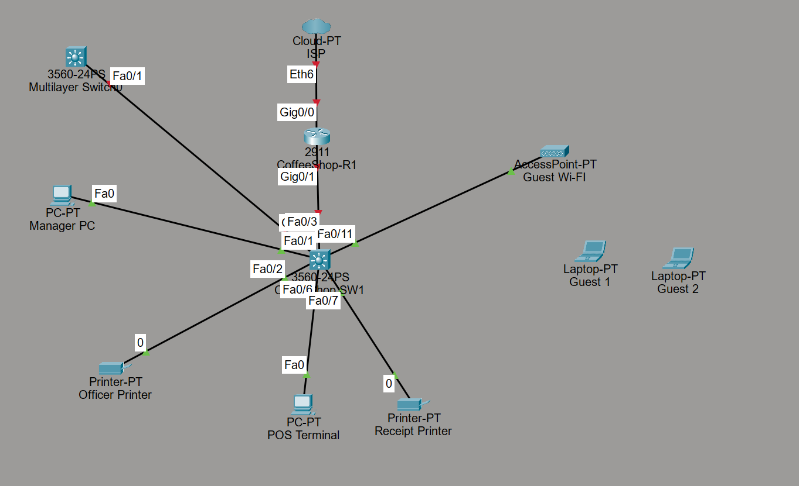

*   **Cisco IOS Console Error Logs:** Running verification commands displays the precise administrative shutdown sequence generated by the operating system, confirming the port was locked down defensively:
    
    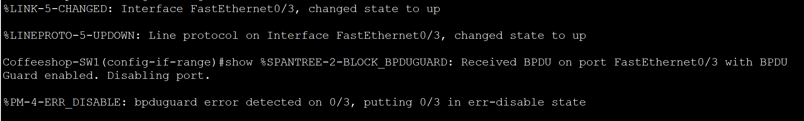

  This simulation why BPDU Guard is a critical operational safeguard. If a future network administrator troubleshooting an endpoint re-enables a physical switchport without realizing `spanning-tree portfast` is active on it, any accidental loop or rogue hardware extension would cause a loop. 


</details>

## Cisco IOS Configuration Breakdown (Coffeeshop_R1)

The edge routing infrastructure utilizes a Cisco 2911 Integrated Services Router to establish logical inter-VLAN communications, automate host addressing pools, and enforce boundary security policies across internal networks.

### 1. Dual-Role IP Automation & DHCP Mapping

*   **`ip dhcp excluded-address`**
    *   **Technical Function:** Reserves specific IP address blocks from dynamic network distribution.
    *   **Project Purpose:** Excludes addresses `.1` through `.20` across all subnets to protect fixed infrastructure assets (such as switch virtual management interfaces, network printers, and cash registers) from IP address lease conflicts.
*   **`ip dhcp pool`**
    *   **Technical Function:** Instantiates a localized dynamic database scope to automate IP parameter distribution to end devices.
    *   **Project Purpose:** Streamlines retail operations by automatically provisioning client devices with addresses on distinct, isolated networks:
        *   `Office_Management`: Services back-office administrative corporate computers (`192.168.10.0/24`).
        *   `POS`: Mandates dedicated network space for transaction terminal domains (`192.168.20.0/24`).
        *   `wifi`: Establishes public customer internet access allocation (`192.168.30.0/24`).
*   **`default-router` & `dns-server`**
    *   **Technical Function:** Injects local subinterface paths and external DNS resolution parameters natively into the client's automated DHCP lease packet.
    *   **Project Purpose:** Dictates exactly where local laptops, registers, and customer devices must send data packets when attempting to cross out of their local network segments.

### 2. Logical Inter-VLAN Routing (Router-on-a-Stick)

*   **`interface GigabitEthernet0/1.[10 / 20 / 30 / 99]`**
    *   **Technical Function:** Generates virtual logical subinterfaces from a single physical uplink port.
    *   **Project Purpose:** Allows multiple distinct local networks to share a single physical cable connecting the switch to the router, maximizing the shop's hardware allocation.
*   **`encapsulation dot1Q [VLAN-ID]`**
    *   **Technical Function:** Binds the subinterface to process specific IEEE 802.1Q tagged frame headers arriving from the trunk.
    *   **Project Purpose:** Instructs the router's interface how to read incoming VLAN packet markers from the switch, route them across subnets, and re-apply tags before passing traffic back down.

### 3. Perimeter Access Control List (ACL) Hardening

*   **`ip access-list extended Guest_Restrictions`** -> **`ip access-group Guest_Restrictions in`**
    *   **Technical Function:** Binds an extended network protocol filter list to inspect inbound traffic hitting the Guest Wi-Fi gateway interface.
    *   **Project Purpose:** Fulfills mandatory **PCI-DSS transaction security baselines** by completely cutting off public access to payment terminals, back-office administration systems, and direct network hardware controls.
*   **`permit udp any eq bootpc any eq bootps`**
    *   **Technical Function:** Explicitly whitelists dynamic bootp traffic across ports 67 and 68.
    *   **Project Purpose:** Ensures untrusted customer laptops can still safely request an automated configuration profile from the router, despite the surrounding security block rules.
*   **`deny ip 192.168.30.0 0.0.0.255 [192.168.10.0 / .20.0 / .99.0]`**
    *   **Technical Function:** Drops any IP packets sourcing from the public Wi-Fi pool moving toward corporate operational segments.
    *   **Project Purpose:** Completely isolates the back-office environment, payment terminals, and network management systems from untrusted customer visibility.
*   **`permit ip any any`**
    *   **Technical Function:** Overrides the implicit deny-all rule at the absolute bottom of the Access Control List.
    *   **Project Purpose:** Ensures that regular permitted internal or diagnostic traffic from the guest network can clear the list after passing the internal security check rules.

## Inter-VLAN Routing Verification & Traffic Validation

To verify that the Core Router (`Coffeeshop_R1`) is correctly routing internal traffic while maintaining strict security boundaries, a series of ICMP ping tests were conducted from the Management Office environment.

<details>
<summary><b>Click to View Inter-VLAN Verification & Security Screenshots</b></summary>

### 1. Intra-VLAN Successful Communication (Office PC to Office Printer)
*   **The Test:** A ping was sent from the Manager PC (`192.168.10.x`) to the Officer Printer residing on the exact same network segment (`VLAN 10`).
*   **Expected Result:** Successful ICMP replies. This confirms that basic Layer 2 access and switching connectivity are completely operational within the local management office subnet.

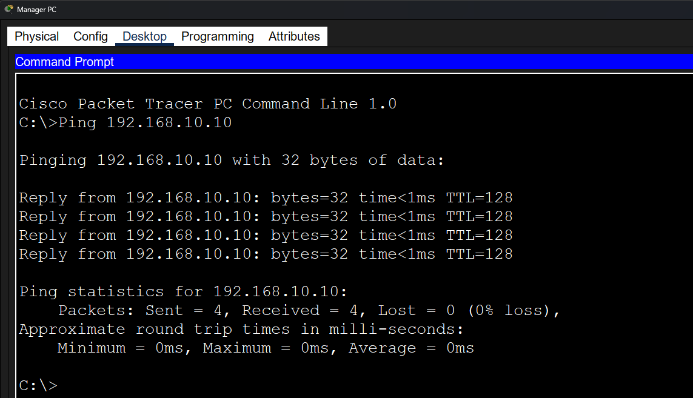

### 2. Inter-VLAN Successful Routing (Office PC to POS Computer)
*   **The Test:** A cross-subnet ping was executed from the Manager PC (`VLAN 10`) over the `Gi0/1` trunk line to a cash register terminal on the Point of Sale network (`VLAN 20`).
*   **Expected Result:** Successful ICMP replies. This validates that the router's 802.1Q subinterfaces (`Gi0/1.10` and `Gi0/1.20`) are functioning perfectly, allowing authenticated corporate staff to monitor or manage store transaction hardware.

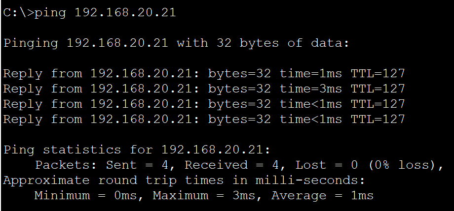

### 3. Security Boundary Restriction (Office PC to Guest Laptop)
*   **The Test:** A ping was attempted from the Manager PC (`VLAN 10`) to one of the public customer wireless endpoints on the Guest Wi-Fi pool (`VLAN 30`).
*   **Expected Result:** Request Timed Out or Destination Host Unreachable. This explicitly proves that our extended Access Control List boundaries are running without leaks, preventing any cross-subnet data exposure or unauthorized network mapping between public guests and private infrastructure.

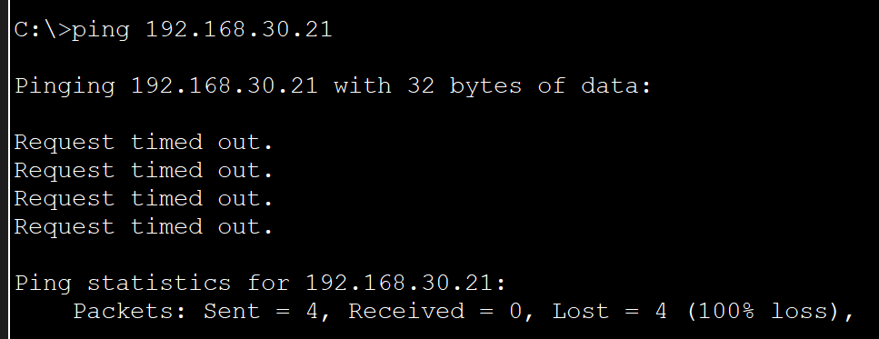

</details>

## Dynamic Host Addressing Verification & DHCP Validation

To verify that the Core Router (`Coffeeshop_R1`) is successfully automating IP assignments across all distinct broadcast domains, endpoint devices were toggled to dynamically request network parameters.

<details>
<summary><b>Click to View Dynamic DHCP Addressing Screenshots</b></summary>

### Core Router DHCP Resource Monitoring (`show ip dhcp pool`)
*   **The Test:** Executed the standard resource monitoring command on the Core Router CLI to audit the active utilization, available lease counts, and dynamic address allocation states across all three configured business subnets.
*   **Expected Result:** Successful execution displaying a real-time tracking metric table. The terminal output explicitly validates that our dynamic scopes (`Office_Management`, `POS`, and `wifi`) are active, tracking accurate subnet ranges, and successfully monitoring live leased address bindings across our local area network.

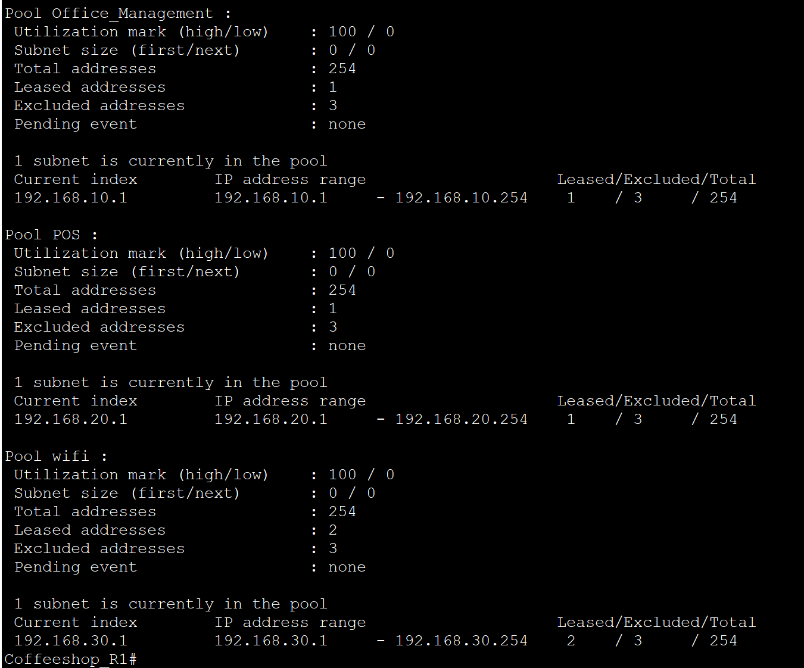

### 1. Wired Subnet Automation Validation (Office Workstation DHCP Lease)
*   **The Test:** The local network interface card configuration on the Manager PC (`VLAN 10`) was toggled from a manual allocation state to dynamic acquisition mode to trigger a standardized DHCP handshake process.
*   **Expected Result:** Successful IP allocation. The host instantly fetched a conflict-free IP address (`192.168.10.21`), subnet mask, and local default gateway matching its specific broadcast domain, validating that the dynamic scope exclusions are operating properly.

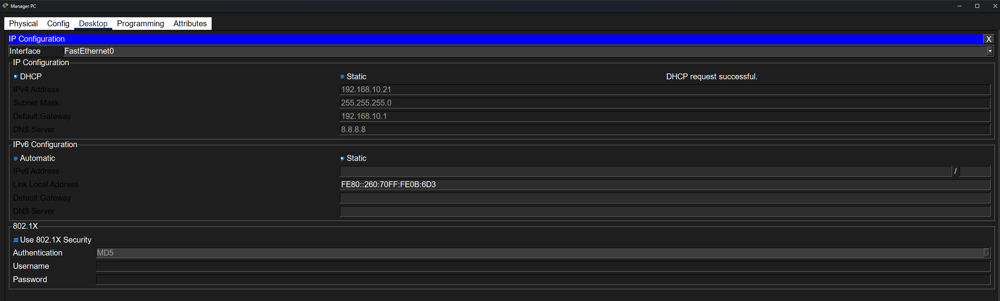

### 2. Transaction Tier Automation Validation (POS Terminal DHCP Lease)
*   **The Test:** A network property initialization check was run on a register terminal endpoint sitting inside the cash handling block (`VLAN 20`) to verify automated gateway availability.
*   **Expected Result:** Successful IP allocation. The terminal successfully pulled an address starting above the static reservation threshold (`192.168.20.21`), confirming that financial infrastructure devices can dynamically register and reach the network instantly upon booting up.

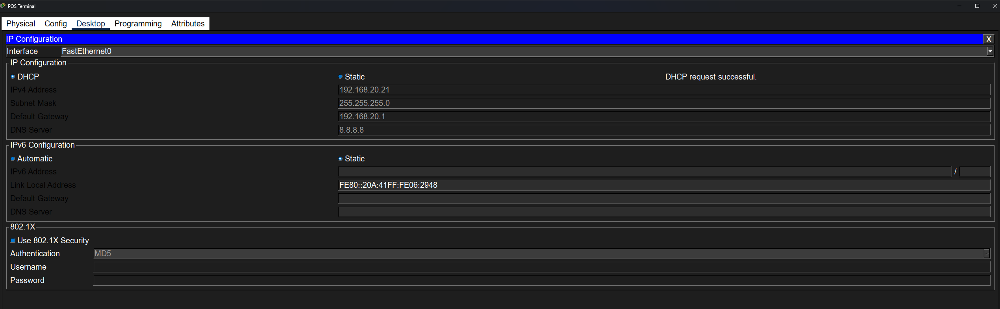

### 3. Public Segment Wireless Automation Validation (Guest Laptop DHCP Lease)
*   **The Test:** A wireless client device completed a physical radio link-state connection to the public Access Point SSID and submitted an untagged broadcast query up the switchport pipeline toward the router.
*   **Expected Result:** Successful IP allocation. The wireless endpoint successfully bypassed the surrounding security perimeter filters and fetched its correct dynamic parameter lease (`192.168.30.21`), proving that the router handles untagged guest queries flawlessly.

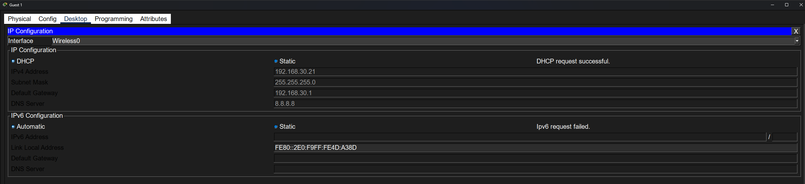

</details>

## Troubleshooting Log: Post-Deployment Issues & Resolutions

### 1. Total Network Addressing Blackout (Missing Trunk Link Operational Mode)

#### The Problem & Diagnostic Discovery Process
During initial post-configuration verification, a client laptop attempting to establish a wireless connection to the public Access Point failed to acquire a dynamic IP address lease from the DHCP pool. To isolate the issue, a systemic network-wide audit was conducted, confirming that none of the host nodes across any of the logical subnets (Management Office or Point of Sale tiers) were receiving dynamic IP addresses. Endpoints were defaulting to localized APIPA addresses (`169.254.x.x`).

To isolate whether the issue was a total network layer failure or a boundary routing block, the following diagnostic steps were executed sequentially:
1.  **Local Intra-VLAN Testing:** A manual static IP configuration was temporarily assigned to a workstation in the Management Office (`VLAN 10`). A local ICMP verification ping was sent to the office network printer, which also occupied a static allocation on `VLAN 10`. This test was completely successful, proving that local Layer 2 access connectivity inside a single broadcast domain was fully operational.
2.  **Cross-Subnet Inter-VLAN Testing:** From the same statically assigned Management workstation, a cross-subnet ICMP verification ping was attempted toward a core printer terminal located inside the secure Point of Sale segment (`VLAN 20`), which possessed a fixed static IP address. This cross-subnet communication test completely failed.

#### Technical Root Cause Analysis
The successful local ping combined with the failed cross-subnet ping explicitly isolated the architectural flaw to the backbone infrastructure boundary. Local frames were passing through the access switch, but tagged frames were failing to reach the default gateway on the router.

An audit of the Cisco Catalyst 3560 Multilayer Switch uplink interface (`interface GigabitEthernet0/1`) confirmed that while the IEEE 802.1Q frame encapsulation parameter details were defined, the core command to transition the link state into an active operational trunk was missing. Because multilayer switch ports default to dynamic auto-negotiating access configurations, the interface refused to act as a trunk line. Consequently, the switch treated the backbone connection as a standard, single-VLAN access link, dropping any dynamic DHCP broadcast requests or ICMP packets wrapped in external VLAN headers (`10`, `20`, `30`, `99`) before they could travel upstream to the router's virtual subinterfaces.

#### The Resolution
To open the multi-subnet transit pathway, the uplink interface configuration mode was accessed via the Switch CLI to explicitly lock down static trunking operations:

```text
Coffeeshop-SW1# configure terminal
Coffeeshop-SW1(config)# interface GigabitEthernet0/1
Coffeeshop-SW1(config-if)# switchport trunk encapsulation dot1q
Coffeeshop-SW1(config-if)# switchport mode trunk
```

Following the execution of the mode initialization command, the Spanning Tree loop-mitigation filters re-converged to a forwarding state. The uplink interface successfully began processing tagged frames, allowing all local client workstations, payment registers, and wireless hosts to complete their dynamic handshakes and pull their correct `192.168.x.x` leases immediately.


